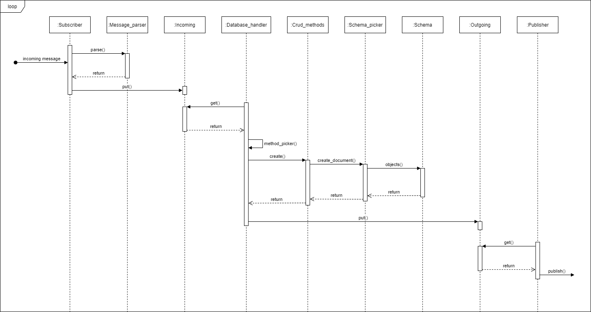

# Group 6 - Documentation Repository 

## Purpose:
#### Task:

The task is to produce a system for simplifying scheduling and booking of dentist appointments.
This is accomplished by creating a web page where end-users can; 
1. Browse for dentists close to the end-users location.
2. View dates where the selected dentist has available time slots for appointments.
3. Book an appointment with the selected dentist.

#### Team members:

* Karim Abdeldayem 
* Alexander Hultén 
* Ali Karkhaneh
* Karam Khatib
* Jakob Roseke
* Zhijie Wei
* Rilind Zuta

#### Links to relevant resources:

* [Trello board](https://trello.com/b/Lbiy2ndE/dit-355-2020-team-6)
* [Front end repository](https://git.chalmers.se/courses/dit355/2020/group-6/web-frontend)
* [Back end repository](https://git.chalmers.se/courses/dit355/2020/group-6/web-backend)
* [External-api-communicator repository](https://git.chalmers.se/courses/dit355/2020/group-6/json-parser)
* [Database component repository](https://git.chalmers.se/courses/dit355/2020/group-6/database-component)

## Software Requirement Specification (SRS):
#### Front-end
* FR1. The system shall allow the user to navigate through a map that shows available dentists in Gothenburg
* FR2. The system shall allow the user to book by day and time
* FR3. The system shall allow dentists to send available time
* FR4. The system shall display available booking times in the calendar

#### Back-end
* FR5. The system shall allow multiple users to use the web-service at the same time
* FR6. The system shall check if the day of the requested appointment is free or not
* FR7. The system shall send a log of all appointments to the database.

#### External-api-component
* FR8. The system shall be able to parse a json-object into a text format.
* FR9. The system shall be able to retrieve dentist information from an external API
* FR10. The system shall check if the current dentist information is different to the external API in order to know if an update is needed.

#### Database
* FR11. The system shall be able to store dentist information.
* FR12. The system shall be able to store booked appointment information.
* FR13. The system shall be able to retrieve stored dentist information.
* FR14. The system shall be able to update stored dentist information.
* FR15. The system shall be able to delete stored dentist information.

## Software Architecture Document (SAD):
As this is a distributed system it is clear that all intra-component communication will be handled by a publish-subscribe style architecture. This will be handled through mqtt as prescribed by the assignment description.

The system will be available as a web application for end-user consumption designed with a client-server architectural style where the client is a GUI and a backend, the server, that handles the requests from the clients. In our case, the requests will be the MQTT messages going through our broker.

Furthermore, the system will implement a fault-tolerance function with a circuit-breaker component. This component will be designed with a blackboard style where the blackboard contains the information about the incoming and outgoing message queues for the subscriber and publisher to work with, respectively.

* Deployment diagram: 
* Component diagram:  

#### Database-component

* Component diagram:  
* Sequence diagram:  
#### External-API-Communicator

* Sequence diagram:   

#### Backend-component
* Class diagram:   
* Sequence diagram of a booking scenario:   

#### WebGUI-component
* Component diagram:   

## Project Management Report (PMR):
#### Process
We will be using Scrum as our main process as it suits the way we develop this product with incremental requirements, sprints (milestones), and activities surrounding scrum.

#### Product Owner(s) 
* Felix Dobslaw
* Francisco Gomez
* Konrad Otto

#### Scrum master
* Karam Khatib

*Could be changed if needed*

#### Development team
* Karam Khatib
* Jakob Roseke
* Alexander Hultén
* Rilind Zuta
* Zhijie Wei
* Ali Karkhaneh
* Karim Abdeldayem

#### We will have weekly meetings on
* Mondays at 13:00
* Project meeting with POs on Wednesdays at 11:30
* Fridays at 10:00

*Additional meetings may occur when needed*

